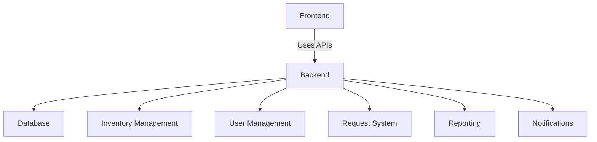

# Architecture of the EPI Management System

## System Structure and Architecture

The EPI Management System is structured to efficiently handle the management of personal protective equipment (EPIs) through various modules.

### Components Overview
1. **Frontend**: The user interface where users can interact with the system, providing all necessary functionalities for managing EPIs.
2. **Backend**: The server-side logic responsible for handling requests from the frontend, processing data, and interacting with the database.
3. **Database**: A relational database that stores all data related to inventory, user management, requests, reports, and notifications.

### Modules
- **Inventory Management**: Responsible for tracking available EPIs, along with information regarding stock levels and item details.
- **User Management**: Handles user accounts, roles, permissions, and authentication.
- **Request System**: Manages requests for EPIs, including approval workflows and notifications.
- **Reporting**: Generates reports concerning inventory usage, requests made, and other analytics.
- **Notifications**: Sends alerts and updates to users regarding their requests and inventory status.

### System Relationship Diagram

### Conclusion
This architecture allows for modular development and scalability, making it easier to enhance or modify individual components as necessary.